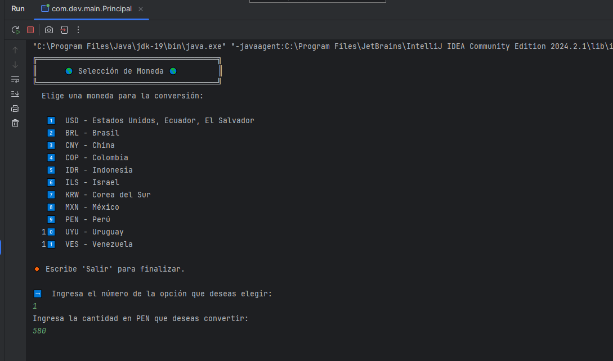
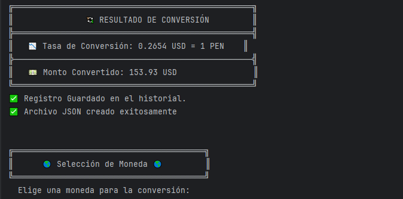
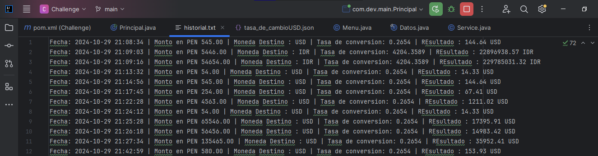

# Conversor de Monedas 💱

## Descripción

Este es un **Conversor de Monedas** desarrollado en Java, que permite a los usuarios convertir una cantidad de dinero en soles peruanos (PEN) a diferentes monedas internacionales. Utiliza una API para obtener tasas de conversión en tiempo real y registra el historial de conversiones realizadas por el usuario.

## Características Principales

- **Interfaz de Usuario Interactiva**: Un menú fácil de usar que permite a los usuarios seleccionar la moneda de destino.
- **Conversión en Tiempo Real**: Obtiene tasas de conversión actualizadas utilizando una API externa.
- **Registro de Historial**: Guarda cada conversión realizada en un archivo de historial para referencia futura.
- **Programación Orientada a Objetos (POO)**: Utiliza principios de POO para organizar el código y mejorar su mantenibilidad.

## Tecnologías Utilizadas

- **Java 11** o superior
- **API REST**: Utiliza la API de ExchangeRate para obtener tasas de conversión.
- **Gson**: Para el manejo de JSON y deserialización de datos.

## Estructura del Código

El proyecto está dividido en varias clases, cada una con su propia responsabilidad:

- **Principal**: Clase principal que maneja la interacción del usuario y el flujo del programa.
- **Datos**: Clase que representa la estructura de los datos obtenidos de la API.
- **Menu**: Clase que muestra el menú de opciones de monedas al usuario.
- **Service**: Clase que contiene métodos para realizar las conversiones y manejar la API.

## Funcionalidades de las Clases

### Clase Principal

La clase `Principal` es el punto de entrada del programa. Aquí se inicializan los componentes necesarios y se controla el flujo del programa. Permite a los usuarios:

- Seleccionar una moneda.
- Ingresar un monto a convertir.
- Ver el resultado de la conversión.
- Salir del programa.

### Clase Datos

La clase `Datos` representa la respuesta JSON de la API. Contiene la siguiente información:

- **resultado**: Indica el éxito o fracaso de la conversión.
- **documentacion**: Enlace a la documentación de la API.
- **terminosDeUso**: Enlace a los términos de uso de la API.
- **tasaDeConversion**: Tasa de conversión entre PEN y la moneda seleccionada.

### Clase Menu

La clase `Menu` se encarga de mostrar el menú de selección de moneda. Proporciona una forma clara y estructurada para que el usuario elija la moneda de conversión.

### Clase Service

La clase `Service` realiza las operaciones de conversión de monedas. Sus principales métodos incluyen:

- `getCambio(String codigo)`: Obtiene la tasa de conversión desde la API.
- `convertirMonto(double monto, double tasaDeConversion)`: Realiza la conversión del monto basado en la tasa proporcionada.
- `guardarEnHistorial(...)`: Registra cada conversión realizada en un archivo de historial.
- `guardarCambioEnArchivo(...)`: Guarda la tasa de cambio en un archivo JSON.

## Ejemplo de Uso

1. Al ejecutar el programa, aparecerá un menú donde podrás seleccionar la moneda de destino.
2. Ingresa el monto que deseas convertir en soles peruanos (PEN).
3. El programa te mostrará la tasa de conversión y el monto convertido.
4. Puedes ver tu historial de conversiones en el archivo `historial.txt`.

## Capturas de Pantalla

### Menú de Selección de Moneda



### Resultado de Conversión



### Historial de Conversiones



## Instalación

1. Clona el repositorio:
   ```bash
   git clone https://github.com/Dev-Asfix/Conversor.git
